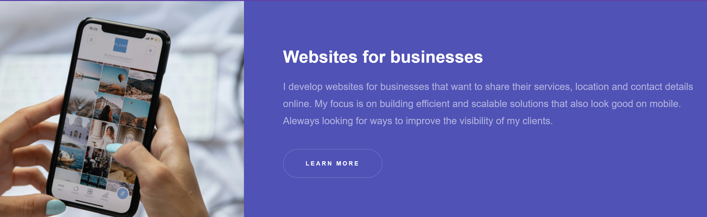

# Responsive Web Design – Hyperspace

[Live Demo](https://raimonvibe.github.io/responsive_web_design/)

## Introduction 💻👩‍💻
To begin this story, I’d like to share the journey of creating this responsive design project 🦦. It all started as a quiet vision—an idea that hovered like a half-remembered dream. I longed for a design that could adapt gracefully to any screen, just as my thoughts once sought balance and meaning in the quiet hours of the night.

## The Journey 🌌
I remember those early days when the wireframe was nothing more than a gentle murmur in my mind. Slowly, as I tinkered with HTML, CSS, and JavaScript, that murmur grew into a vibrant, blocky layout that danced across my screen. Every element was carefully chosen, every line of code a step towards crafting something alive—something that could tell its own story. This project became my canvas, a place where creativity met functionality, and the result is a design that is both bold and introspective 🦦💻.

## Project Details 🔍
This project is built upon the timeless Hyperspace template by HTML5 UP, carrying with it a spirit of innovation and resilience. Here’s what you’ll find inside:
- **One-Page Layout:** A seamless, flowing experience that guides you through a single, elegant scroll.
- **Interior Page Template:** A thoughtfully crafted page for deeper narratives, proving that even a single-page design can hold endless stories.
- **Responsive Elements:** A design that adapts beautifully to every device—from the sleek power of a high-end PC to the intimate touch of a woman behind her computer 👩‍💻.
- **Subtle Animations:** Gentle motions that bring the page to life, inviting you to explore without overwhelming your senses.

## Technologies Embraced 🛠️
Every project has its tools, its instruments of creation. For this design, I embraced:
- **HTML5:** The sturdy framework upon which everything is built.
- **CSS & SCSS:** The artistry behind every color and curve, ensuring the design feels both modern and timeless.
- **JavaScript:** Breathing interactivity and dynamism into every element.
- **jQuery & Scrollex:** These libraries added that extra touch of elegance with smooth, scroll-based animations.
- **Responsive Tools:** The secret behind every perfect breakpoint, ensuring the design is as adaptable as the dreams that inspired it 🦦.

## File Structure – The Blueprint of Our Journey 📁
responsive_web_design/ ├── assets/ # Visual treasures: fonts, icons, and more ├── images/ # Captured moments and imagery that bring life to the design ├── index.html # The main stage of our one-page experience ├── about.html # A welcoming space for additional narratives ├── web-design.png # A snapshot capturing the essence of the design ├── .htaccess # Behind-the-scenes magic for server configurations ├── LICENSE # The legal parchment under which this work is shared └── README.md # This very story, unfolding in words

csharp
Copy

## Credits and Acknowledgements 🤝
No journey is complete without the gentle support of others:
- **Template Inspiration:** Hyperspace by [HTML5 UP](http://html5up.net/), a gift under the Creative Commons Attribution 3.0 License that sparked my imagination.
- **Visual Assets:** Beautiful, free-to-use images courtesy of [Unsplash](https://unsplash.com/), each one a fleeting moment of perfection.
- **Icons:** Elegantly designed by [Font Awesome](http://fontawesome.io/), adding subtle symbols that speak louder than words.
- **Libraries and Tools:** With a nod to jQuery, Scrollex, and Responsive Tools, whose quiet efficiencies helped this project come alive.

## Reflections and Next Steps ✨
As I continue to refine this digital canvas, I carry with me the spirit of exploration and the memory of every small victory. Each update is not just a tweak in the code, but a step further into a dream realized—a journey where technology and art merge in unexpected ways 🦦. Whether it’s through the glow of a PC screen or the focused energy of a woman behind her computer 👩‍💻, every detail is a reminder of the passion that fuels this work.

## License 📜
This project is shared under the Creative Commons Attribution 3.0 License. For all the details, please refer to the [LICENSE](LICENSE) file.

## Final Thoughts 💭
In this ever-changing world of digital dreams, I invite you to step into this creation and experience the harmony of responsive design. May this work inspire you to find beauty in every line of code and every pixel of light. Keep dreaming, keep coding, and let the journey continue 🦦💻👩‍💻.
